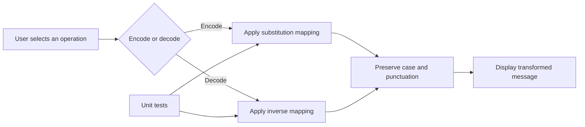
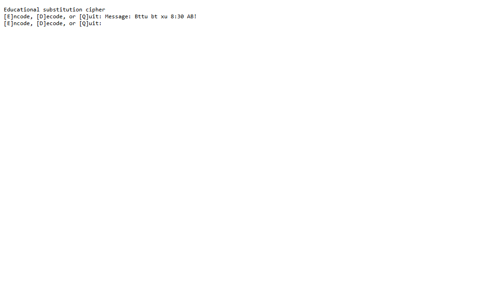
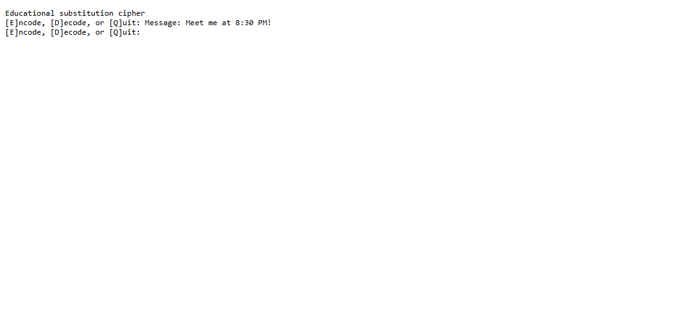

# Cybersecurity Python Projects

[](https://www.python.org/)
[](#substitution-cipher)
[](#substitution-cipher)

Small, tested Python projects that explain security concepts through code.

## Program flow



## Substitution cipher

A command-line monoalphabetic substitution cipher with reusable encode/decode functions, input validation, and automated tests.



### Encode and decode verification



The two CLI captures demonstrate both transformation directions while preserving capitalization, spaces, numbers, and punctuation.

Run it with:

```console
python substitution-cipher/substitution_cipher.py
python -m unittest discover -s tests -v
```

Concepts demonstrated:

- Reversible character transformations
- Separation of reusable logic from the command-line interface
- Input validation and unit testing
- Why classical substitution is unsuitable for real security

> This is an educational cryptography exercise, not secure encryption.

## Verification

The test suite checks a known encoding, reversible round trips, preservation of case and punctuation, and rejection of invalid substitution keys.

Run the test suite with `python -m unittest discover -s tests -v` to verify the reversible transformation and input validation behavior.

Run the test suite with `python -m unittest discover -s tests -v` to verify the reversible transformation and input validation behavior.

## About the author

Built by **Ahmed Balde** as part of a broader cybersecurity and Python engineering portfolio. See more work on [GitHub](https://github.com/fetachino).
